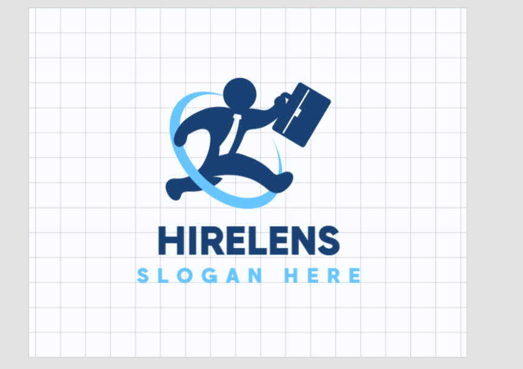
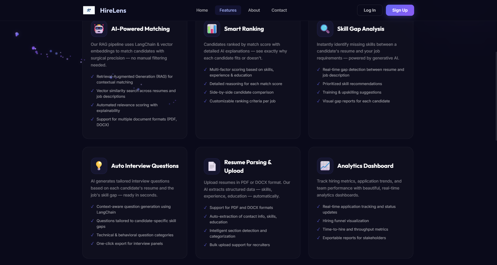
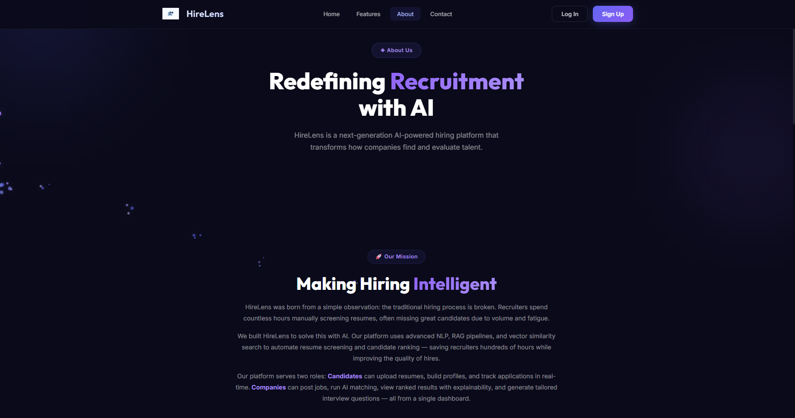
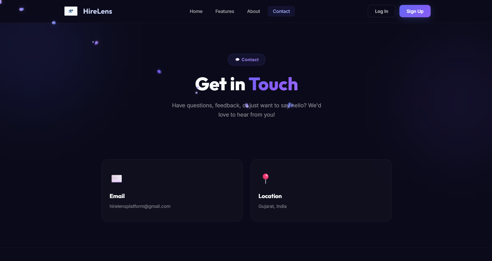
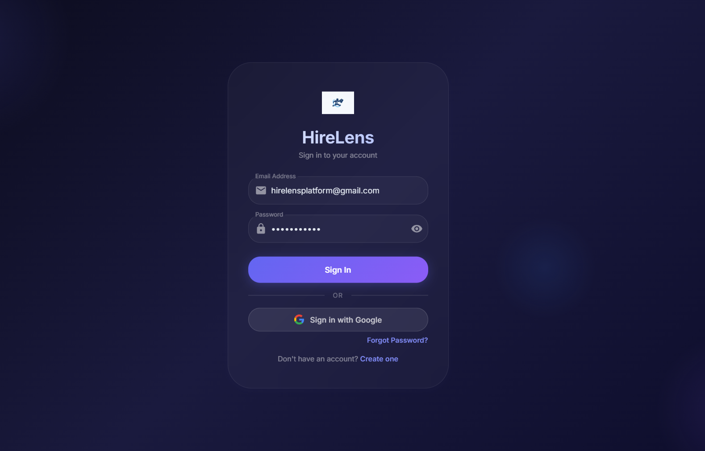

<p align="center">
  
</p>

<h1 align="center">HireLens</h1>
<h3 align="center">AI-Powered Intelligent Recruitment & Applicant Tracking System</h3>

<p align="center">
  
  
  
  
  
  
</p>

<p align="center">
  <b>A next-generation, full-stack recruitment platform that uses Generative AI to intelligently screen, rank, and evaluate candidates — going far beyond traditional keyword-based ATS filtering.</b>
</p>

---

> ⚠️ **This is a private repository.** Source code is not publicly available. This README serves as a comprehensive project showcase and documentation.

---

## 📸 Screenshots

### 🏠 Landing Page & Public Pages

<details>
<summary>Click to expand</summary>
<br>

#### Home Page


#### Features


#### About


#### Contact


</details>

---

### 🔐 Authentication

<details>
<summary>Click to expand</summary>
<br>

#### Login


#### Sign Up


</details>

---

### 👤 Candidate Portal

<details>
<summary>Click to expand</summary>
<br>

#### Candidate Dashboard


#### Upload Resume


#### Browse Jobs


#### Job Detail & Apply


#### My Interviews


#### AI Interview — Take Test


#### AI Interview — Evaluation Results


#### AI Interview — Score & Feedback


</details>

---

### 🏢 Company / Recruiter Portal

<details>
<summary>Click to expand</summary>
<br>

#### Company Dashboard


#### Post a Job


#### Submitted Resumes


#### Job Applicants


#### Recruiter Analytics


</details>

---

### 🤖 AI-Powered Features

<details open>
<summary>Click to expand</summary>
<br>

#### AI Resume Ranking (Leaderboard)


#### AI Resume Match Analysis


#### AI Skill Gap Analysis


#### AI Interview Questions


</details>

---

### 🛡️ Admin Panel

<details>
<summary>Click to expand</summary>
<br>

#### Admin Dashboard


#### Manage Users


</details>

---

## 🎯 What Problem Does HireLens Solve?

Traditional ATS tools rely on **keyword matching** — they reject great candidates just because their resume doesn't contain the exact keywords. HireLens flips this with **Generative AI and semantic understanding**:

| Traditional ATS | HireLens |
|----------------|----------|
| Keyword matching only | Semantic AI understanding |
| Binary pass/fail | Match score 0-100% with explanation |
| No skill insights | Detailed skill gap analysis |
| Generic interview prep | AI-tailored interview questions per candidate |
| Manual screening | Automated ranking leaderboard |
| No candidate feedback | AI-generated reasoning for every decision |

---

## 👥 User Roles & Capabilities

### 👤 Candidate (Job Seeker)
- Register & verify email via OTP
- Build detailed profile (bio, skills, education, experience, projects, social links)
- Upload resume (PDF/DOCX) — auto-parsed via AI
- Browse & search jobs with filters
- Apply to jobs with job-specific resumes
- Track application status in real-time
- Take AI-generated interview tests (15 tailored questions)
- View interview results with per-question feedback
- Bookmark/save jobs for later
- Receive real-time notifications on status changes

### 🏢 Company (Recruiter)
- Register with company details (requires admin approval)
- Manage company profile
- Post unlimited job listings with skills, qualifications, and experience level
- View all applicants per job with resume details
- **Run AI Ranking** — get all candidates ranked by match score with explanations
- Shortlist, reject, or move candidates to interview — individually or in bulk
- View AI skill gap analysis per candidate
- Generate AI interview questions per candidate
- Review candidate interview answers and AI evaluation scores
- Export candidate data as CSV
- View recruiter analytics dashboard with charts

### 🛡️ Admin
- Dashboard with platform-wide statistics
- Approve or reject company registrations
- Manage all users (candidates + companies)
- View and manage all jobs and applications
- Full CRUD control over platform data

---

## 🤖 AI Features Deep Dive

HireLens uses **Anthropic Claude Sonnet 4.5** as its AI backbone. Every AI feature is production-grade with caching, error handling, and result persistence.

### 1. 📄 Resume Parsing
```
Upload (PDF/DOCX) → Text Extraction (PyMuPDF / python-docx) → Structured Data
```
- Extracts raw text from resumes using PyMuPDF (for PDFs) and python-docx (for DOCX)
- Also extracts text from tables within documents
- Auto-estimates years of experience using regex pattern matching
- Supports both general resumes and job-specific resume submissions

### 2. 🏆 AI Candidate Ranking
```
Job Description + All Candidate Resumes → Claude AI → Ranked Leaderboard (0-100%)
```
- Evaluates each candidate's resume against the job description
- Returns a **match score (0-100)** and a **2-3 sentence reasoning**
- Pre-filters candidates with insufficient resume data to save API tokens
- Results are persisted in the database for instant recall
- Candidates are sorted in descending order by score

### 3. 🔍 Skill Gap Analysis
```
Job Requirements + Candidate Resume → Claude AI → Analysis + Learning Recommendations
```
- Compares candidate's skills precisely against job requirements
- Returns a professional analysis paragraph highlighting strengths and gaps
- Provides actionable learning recommendations to bridge skill gaps
- Results are cached per application to avoid redundant API calls

### 4. 📝 AI Interview Questions
```
Job Description + Candidate Resume → Claude AI → 15 Tailored Questions
```
- Generates exactly **15 interview questions** per candidate-job combination
- Questions progress from basic concepts to advanced scenarios
- Each question includes: question text, evaluation intent, and expected answer
- Questions are cached on the application record after first generation
- Candidates see only questions (not intents/answers); companies see everything

### 5. ✅ AI Interview Evaluation
```
15 Questions + Candidate Answers + Expected Answers → Claude AI → Score + Feedback
```
- Each question scored as 0 or 1 (total out of 15)
- Pass threshold: **10/15 (≈67%)**
- Returns overall reasoning + per-question feedback
- Automatically updates application status to `interview_passed` or `interview_failed`

### 6. 👤 AI Candidate Summary
```
Candidate Resume → Claude AI → 3-4 Sentence Professional Summary
```
- Auto-generates a compelling professional introduction
- Highlights years of experience, core expertise, and achievements
- Cached on the user record for instant retrieval

---

## 🛠️ Tech Stack

### Frontend
| Technology | Purpose |
|-----------|---------|
| **React 19** | UI framework with hooks & functional components |
| **Vite 7** | Lightning-fast dev server & build tool |
| **Material UI (MUI) 7** | Component library with dark theme customization |
| **React Router 7** | Client-side routing with role-based protection |
| **Axios** | HTTP client with JWT interceptors |
| **Chart.js + react-chartjs-2** | Analytics dashboard charts |
| **Context API** | Global auth state management |

### Backend
| Technology | Purpose |
|-----------|---------|
| **Python 3.10+** | Core language |
| **FastAPI** | Async REST API framework with auto-docs |
| **Motor** | Async MongoDB driver |
| **Pydantic v2** | Request/response validation & settings |
| **python-jose** | JWT token creation & verification |
| **bcrypt** | Password hashing |
| **PyMuPDF (fitz)** | PDF text extraction |
| **python-docx** | DOCX text extraction |
| **aiosmtplib** | Async email sending |
| **Anthropic SDK** | Claude AI integration |

### Database & Infrastructure
| Technology | Purpose |
|-----------|---------|
| **MongoDB** | Primary database (async via Motor) |
| **7 Collections** | users, resumes, jobs, applications, notifications, job_resumes, otps |

---

## 🏗️ System Architecture

```
┌──────────────────────────────────────────────────────────────┐
│                      FRONTEND (React + Vite)                  │
│                                                                │
│  ┌─────────┐  ┌──────────┐  ┌──────────┐  ┌──────────────┐   │
│  │ Landing  │  │ Auth     │  │ Candidate│  │ Company      │   │
│  │ Pages    │  │ Flow     │  │ Portal   │  │ Portal       │   │
│  └─────────┘  └──────────┘  └──────────┘  └──────────────┘   │
│  ┌─────────────────────┐  ┌──────────────────────────────┐   │
│  │ Admin Panel         │  │ AI Features (Ranking, etc.)  │   │
│  └─────────────────────┘  └──────────────────────────────┘   │
│                          │                                     │
│                   Axios + JWT Interceptor                      │
└──────────────────────────┼────────────────────────────────────┘
                           │ REST API (HTTP)
┌──────────────────────────┼────────────────────────────────────┐
│                    BACKEND (FastAPI)                           │
│                          │                                     │
│  ┌──────────────────────────────────────────────────────────┐ │
│  │                    11 Router Modules                      │ │
│  │  Auth · Candidate · Company · Resume · Jobs              │ │
│  │  Applications · AI · Analytics · Notifications           │ │
│  │  Admin · Contact                                         │ │
│  └──────────────────────────────────────────────────────────┘ │
│                          │                                     │
│  ┌──────────────┐  ┌───────────┐  ┌────────────────────────┐ │
│  │ Controllers  │  │ Services  │  │ Middleware             │ │
│  │ (11 files)   │  │           │  │ JWT Auth + RBAC        │ │
│  │              │  │ • AI      │  └────────────────────────┘ │
│  │              │  │ • Email   │                              │
│  │              │  │ • Parser  │                              │
│  └──────────────┘  └───────────┘                              │
│                          │                                     │
│  ┌──────────────────────────────────────────────────────────┐ │
│  │                   6 Pydantic Models                       │ │
│  │  User · Resume · Job · Application · Notification        │ │
│  │  JobResume                                                │ │
│  └──────────────────────────────────────────────────────────┘ │
└──────────────────────────┼────────────────────────────────────┘
                           │
          ┌────────────────┼────────────────┐
          │                │                │
  ┌───────▼──────┐  ┌─────▼──────┐  ┌──────▼──────┐
  │   MongoDB    │  │ Anthropic  │  │ Gmail SMTP  │
  │  (7 colls)   │  │ Claude AI  │  │ (OTP Email) │
  └──────────────┘  └────────────┘  └─────────────┘
```

---

## 📊 Project Scale & Metrics

| Metric | Count |
|--------|-------|
| **Total REST API Endpoints** | 43+ APIs across 11 modules |
| **Frontend Pages/Screens** | 36 page components |
| **Reusable Components** | 11 shared components |
| **Backend Controllers** | 11 controller files |
| **Backend Routers** | 11 router files |
| **Pydantic Models** | 6 model files with request/response schemas |
| **MongoDB Collections** | 7 collections |
| **Development Duration** | 12 weeks |

### 📡 API Module Breakdown

| Module | APIs | Key Endpoints |
|--------|------|---------------|
| 🔐 **Authentication** | 10 | Register, Login, OTP Verify, Google OAuth, Password Reset |
| 👤 **Candidate** | 3 | Profile CRUD, Account Deletion |
| 📄 **Resume** | 10 | Upload, Parse, Download, Job-Specific Resume, My Submissions |
| 🏢 **Company** | 3 | Profile CRUD |
| 💼 **Jobs** | 6 | CRUD, Search, Filter, My Jobs |
| 📋 **Applications** | 7 | Apply, Track, Bulk Actions, CSV Export, Interview Submission |
| 🤖 **AI & Matching** | 5 | Rank, Skill Gap, Interview Qs, Evaluate, Summary |
| 📊 **Analytics** | 2 | Dashboard Stats, Per-Job Analytics |
| 🔔 **Notifications** | 2 | Get All, Mark Read |
| 🛡️ **Admin** | 8 | Stats, User/Company/Job/Application Management |
| 📬 **Contact** | 1 | Contact Form Submission |

---

## 🖥️ Frontend Pages (36 Total)

| Category | Pages |
|----------|-------|
| **Public** | Landing, Features, About, Contact |
| **Auth** | Login, Signup, Verify Email, Forgot Password, Reset Password |
| **Candidate** | Dashboard, Profile, Resume Upload, Job Browser, Job Detail, Saved Jobs, My Applications, My Interviews, Take Interview |
| **Company** | Dashboard, Profile, Post Job, Edit Job, My Jobs, Job Applicants, Applicant Detail, All Applicants, Company Interviews, Analytics, AI Ranking |
| **Admin** | Dashboard, Users, Companies, Candidates, Jobs, Applications |
| **Misc** | 404 Not Found |

---

## 🔐 Security Implementation

| Feature | Implementation |
|---------|---------------|
| **Password Hashing** | bcrypt with auto-generated salt |
| **JWT Authentication** | HS256 algorithm, 24-hour expiration |
| **Role-Based Access** | Middleware-level RBAC (candidate / company / admin) |
| **Email Verification** | 6-digit OTP with 10-minute expiry |
| **Google OAuth** | Google Sign-In with ID token verification |
| **CORS Protection** | Whitelisted origins only |
| **Input Validation** | Pydantic schemas on all endpoints |
| **Company Approval** | Admin approval required before company can post jobs |
| **Auto 401 Handling** | Frontend auto-redirects on token expiry |

---

## 📁 Project Structure

```
HireLens/
├── backend/
│   ├── main.py                     # FastAPI app entry point (11 routers)
│   ├── config.py                   # Pydantic settings from .env
│   ├── database.py                 # Async MongoDB connection (Motor)
│   ├── requirements.txt            # Python dependencies
│   │
│   ├── Controllers/                # Business logic layer
│   │   ├── auth_controller.py      # Register, Login, JWT, OTP, Password Reset
│   │   ├── ai_controller.py        # AI Ranking, Interview, Skill Gap, Summary
│   │   ├── resume_controller.py    # Upload, Parse, Download, Job-Specific
│   │   ├── application_controller.py # Apply, Track, Bulk, CSV Export
│   │   ├── job_controller.py       # CRUD, Search, Filter
│   │   ├── candidate_controller.py # Profile management
│   │   ├── company_controller.py   # Company profile
│   │   ├── analytics_controller.py # Dashboard metrics
│   │   ├── admin_controller.py     # Platform administration
│   │   ├── notification_controller.py # Real-time notifications
│   │   └── google_auth_controller.py  # Google OAuth flow
│   │
│   ├── Routers/                    # API endpoint definitions
│   │   ├── auth_router.py          # /api/auth/*
│   │   ├── ai_router.py            # /api/ai/*
│   │   ├── resume_router.py        # /api/resume/*
│   │   ├── application_router.py   # /api/applications/*
│   │   ├── job_router.py           # /api/jobs/*
│   │   ├── candidate_router.py     # /api/candidate/*
│   │   ├── company_router.py       # /api/company/*
│   │   ├── analytics_router.py     # /api/analytics/*
│   │   ├── admin_router.py         # /api/admin/*
│   │   ├── notification_router.py  # /api/notifications/*
│   │   └── contact_router.py       # /api/contact/*
│   │
│   ├── Models/                     # Pydantic schemas
│   │   ├── user_model.py           # User, Candidate, Company schemas
│   │   ├── resume_model.py         # Resume upload & parsed data
│   │   ├── job_model.py            # Job posting schemas
│   │   ├── job_resume_model.py     # Job-specific resume schemas
│   │   ├── application_model.py    # Application & status schemas
│   │   └── notification_model.py   # Notification schemas
│   │
│   ├── Services/                   # External service integrations
│   │   ├── ai_service.py           # Claude AI pipeline (6 functions)
│   │   ├── email_service.py        # SMTP email + OTP management
│   │   └── resume_parser.py        # PDF/DOCX text extraction
│   │
│   └── Middleware/
│       └── auth_middleware.py       # JWT verification + RBAC
│
├── frontend/
│   ├── index.html
│   ├── vite.config.js
│   ├── package.json
│   │
│   └── src/
│       ├── App.jsx                 # Router setup + role-protected routes
│       ├── main.jsx                # React entry point
│       ├── index.css               # Global styles (dark theme)
│       │
│       ├── pages/                  # 36 page components
│       │   ├── HomePage.jsx
│       │   ├── LoginPage.jsx / SignupPage.jsx
│       │   ├── CandidateDashboard.jsx
│       │   ├── CompanyDashboard.jsx
│       │   ├── AIRankingPage.jsx
│       │   ├── ApplicantDetail.jsx
│       │   ├── CandidateInterview.jsx
│       │   ├── AnalyticsDashboard.jsx
│       │   └── ... (36 total)
│       │
│       ├── components/             # 11 reusable components
│       │   ├── Navbar.jsx
│       │   ├── AdminLayout.jsx
│       │   ├── JobCard.jsx
│       │   ├── Toast.jsx
│       │   └── ...
│       │
│       ├── services/
│       │   └── api.js              # Axios instance + 50+ API functions
│       │
│       ├── context/
│       │   └── AuthContext.jsx      # Global auth state (React Context)
│       │
│       └── hooks/
│           └── useBookmarks.js     # Job bookmarking hook
```

---

## 🎨 UI/UX Design

- **Dark Theme** — Deep navy (#0a0a1a) with indigo/violet accents (#6366f1, #8b5cf6)
- **Glassmorphism** — Frosted glass effects on cards and forms
- **Material Design** — MUI components with custom dark theme overrides
- **Responsive Layout** — Mobile-first approach across all 36 pages
- **Smooth Animations** — Cursor trails, hover effects, loading skeletons
- **Custom Typography** — Inter + Roboto font stack
- **Interactive Elements** — Animated stats cards, charts, progress indicators

---

## 🚀 How to Run (Development)

### Prerequisites
- Python 3.10+
- Node.js 18+
- MongoDB (local or Atlas)
- Anthropic API Key

### Backend
```bash
cd backend
python -m venv .venv
.venv\Scripts\activate        # Windows
pip install -r requirements.txt
# Create .env with required variables
python main.py                # Runs on http://localhost:8000
```

### Frontend
```bash
cd frontend
npm install
npm run dev                   # Runs on http://localhost:5173
```

### Environment Variables
```env
# MongoDB
MONGO_URI=mongodb+srv://...
DB_NAME=hirelens

# JWT
JWT_SECRET=your_secret_key
JWT_EXPIRATION_MINUTES=1440

# AI
ANTHROPIC_API_KEY=sk-ant-...

# Email (Gmail SMTP)
SMTP_HOST=smtp.gmail.com
SMTP_PORT=587
SMTP_USER=your_email@gmail.com
SMTP_PASSWORD=your_app_password

# Google OAuth
GOOGLE_CLIENT_ID=your_client_id
```

---

## 🔮 Future Roadmap

- 🎥 AI Video Interviews (speech + sentiment analysis)
- 📅 Smart Calendar Scheduling (Google Calendar / Outlook)
- 📈 Predictive Retention Analytics (ML-based tenure prediction)
- 🔗 Chrome Extension for LinkedIn profile import
- 📱 Mobile App (React Native)
- 🎓 Candidate Improvement Plan (personalized learning path for rejected candidates)
- 🛡️ Admin Panel enhancements (audit logs, rate limiting)

---

## 👨‍💻 Built By

**Nikita** — Full Stack Developer

*Designed, developed, and deployed as a complete end-to-end AI-powered recruitment platform over 12 weeks.*

---

<p align="center">
  <b>HireLens — Smarter Hiring, Powered by AI</b><br>
  <sub>Built with ❤️ using React, FastAPI, Claude AI, and MongoDB</sub>
</p>
